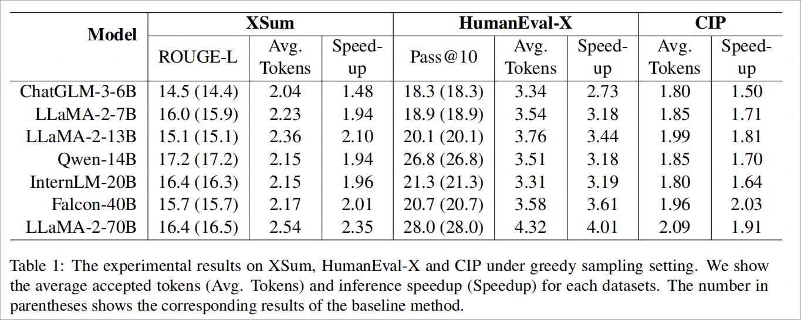

# Generation Meets Verification: Accelerating Large Language Model Inference with Smart Parallel Auto-Correct Decoding


This is the official repository implements **S**mart **P**arallel **A**uto-**C**orrect D**e**coding (**SPACE**), a novel approach to accelerate inference of LLMs by integrating semi-autoregressive inference and draft-then-verify capabilities.


Fig. 1: A visual comparison between conventional AR inference (left) and SPACE inference (right) is illustrated. In AR inference, token generation proceeds in a sequential manner, with only one token output per decoding step. In SPACE inference, the input token sequence (i.e., "LLMs are") is augmented with k+1 groups of mask tokens and k candidate tokens (i.e., "auto" and "model"). The candidate tokens undergo verification to obtain accepted tokens (i.e., "auto" and "regressive"), and k new candidate tokens (i.e., "model" and "\<s\>") are generated from one of the mask groups after a single model invocation. SPACE allows for a variable number of tokens to be generated in each step, with the quantity ranging from a minimum of 1 to a maximum of k+1.

Main Result:


> [Generation Meets Verification: Accelerating Large Language Model Inference with Smart Parallel Auto-Correct Decoding](https://arxiv.org/abs/2402.11809)  
> Hanling Yi, Feng Lin, Hongbin Li, Peiyang Ning, Xiaotian Yu, Rong Xiao

- 🔥🔥🔥  **News**: ```2024/5/16```: [SPACE](https://arxiv.org/abs/2402.11809) was accepted in ACL 2024 Findings!

## Setting Up Environment
Install Dependencies
```bash
pip install -r requirements.txt
```

## Training
We use LLaMa-2-7B as the base model for SPACE training in the example.

Download the checkpoint of LLaMa-2-7B and then change the ``model_name_or_path`` in run_sft_multi_node.sh. Run the following comment to start training on one machine with 8 GPUs.

```bash
bash run_sft_multi_node.sh
```

## Evaluation
For evaluation, change ``llm_dir`` in run_eval.sh to the output dir and run the following for evaluation
```bash
bash run_eval.sh
```

[2024/5/19] We have released a Vicuna-7B model trained with SPACE, please download the checkpoint from [HF](https://huggingface.co/AntMan/vicuna-v1.3-7b-space) and run the following for evalution.
```python
python tests/eval_infer.py --llm_dir=path/to/model --mask_id=32002 --dataset="human_eval" --mask_num=5 --do_sample=false --use_cache=true --model_type=llama --mask_diff=false
```

## License
This repository is licensed under the [Apache-2.0 License](LICENSE).

## Citation

If this work is helpful, please kindly cite as:

```bibtex
@article{yi2024generation,
  title={Generation Meets Verification: Accelerating Large Language Model Inference with Smart Parallel Auto-Correct Decoding},
  author={Yi, Hanling and Lin, Feng and Li, Hongbin and Ning, Peiyang and Yu, Xiaotian and Xiao, Rong},
  journal={arXiv preprint arXiv:2402.11809},
  year={2024}
}
```

## Acknowledgement

This repo benefits from [LLaMA Factory](https://github.com/hiyouga/LLaMA-Factory) and [FastChat](https://github.com/lm-sys/FastChat). Thanks for their wonderful works.

